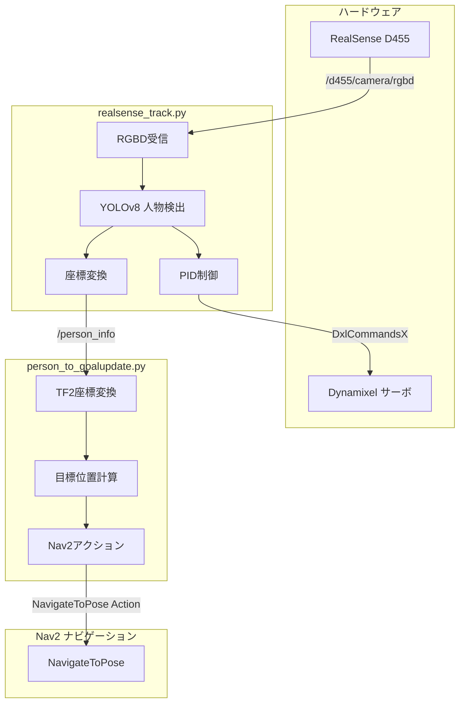
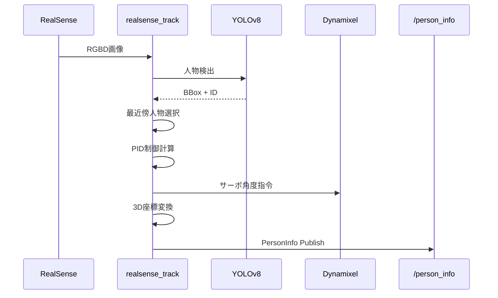
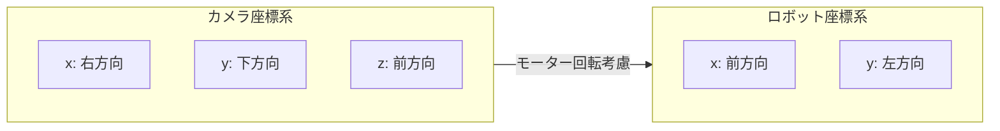
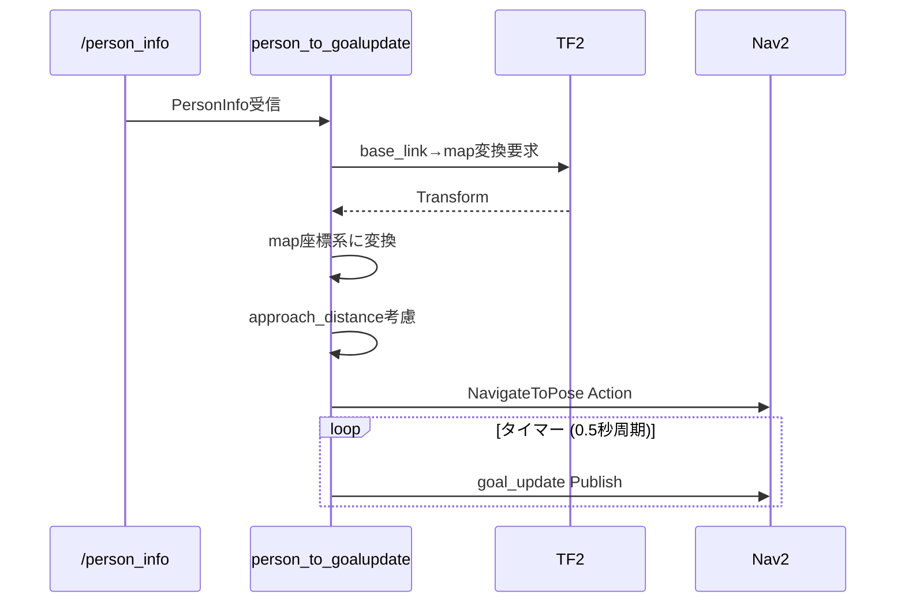
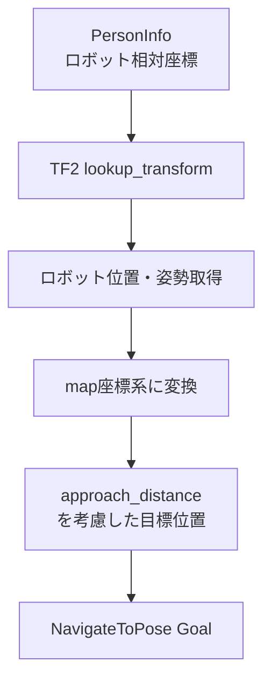
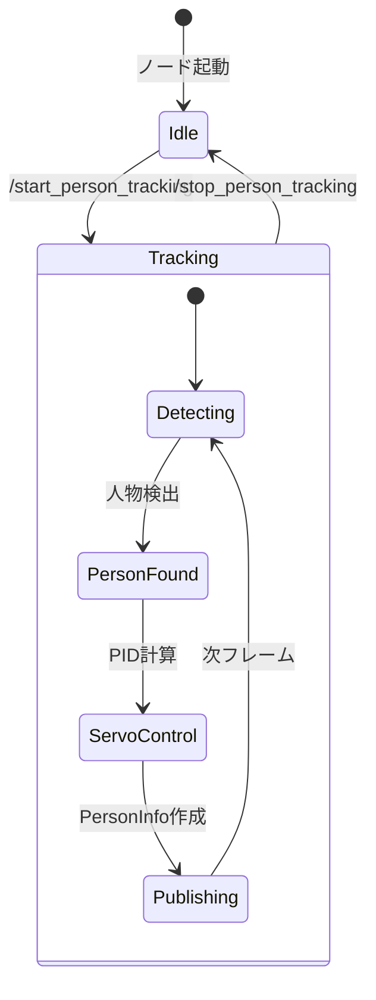

# PyLoT-Robotics-Follow-Person

人物追従機能を提供するROS2パッケージです。RoboCup@Home の Help Me Carry タスクなどで使用します。

## システム概要



## ノード詳細

### 1. realsense_track.py

RealSenseカメラで人物を検出・追跡し、パンチルトサーボで追従するノードです。



#### トピック・サービス

| 種別 | 名前 | 型 | 説明 |
|------|------|-----|------|
| Sub | `/d455/camera/rgbd` | `RGBD` | RGB+深度画像 |
| Sub | `/d455/camera/color/camera_info` | `CameraInfo` | カメラ光学パラメータ |
| Pub | `/person_info` | `PersonInfo` | 人物位置情報 |
| Pub | `/dynamixel/commands/x` | `DxlCommandsX` | サーボ制御指令 |
| Srv | `/start_person_tracking` | `Trigger` | 追跡開始 |
| Srv | `/stop_person_tracking` | `Trigger` | 追跡停止 |

#### 座標変換



**変換式:**
```
base_x = z_3d (カメラのz → ロボットのx)
base_y = -x_3d (カメラのx反転 → ロボットのy)

robot_x = base_x * cos(θ) + base_y * sin(θ)
robot_y = -base_x * sin(θ) + base_y * cos(θ)
```

---

### 2. person_to_goalupdate.py

`PersonInfo` を受信し、Nav2のナビゲーション目標に変換するノードです。



#### パラメータ

| パラメータ | 型 | デフォルト | 説明 |
|-----------|-----|-----------|------|
| `person_topic` | string | `/person_info` | 入力トピック |
| `frame_id` | string | `map` | 目標座標系 |
| `robot_frame_id` | string | `base_link` | ロボット座標系 |
| `approach_distance` | double | `0.5` | 人物への接近距離 [m] |
| `timer_period` | double | `0.5` | 目標更新周期 [秒] |

#### 座標変換処理



**変換式:**
```
person_map_x = robot_x + person_x * cos(yaw) - person_y * sin(yaw)
person_map_y = robot_y + person_x * sin(yaw) + person_y * cos(yaw)
```

---

## 使用方法

### 起動

```bash
# 人物追跡ノードを起動
ros2 run pylot_utils realsense_track

# ナビゲーション連携ノードを起動
ros2 run pylot_utils person_to_goalupdate
```

### サービス呼び出し

```bash
# 追跡開始
ros2 service call /start_person_tracking std_srvs/srv/Trigger

# 追跡停止
ros2 service call /stop_person_tracking std_srvs/srv/Trigger

# 人物追従ナビゲーション開始
ros2 service call /person_follow_active std_srvs/srv/Trigger

# 人物追従ナビゲーション停止
ros2 service call /person_follow_deactive std_srvs/srv/Trigger
```

---

## 依存関係

### 必須ライブラリ
- `ultralytics` (YOLOv8)
- `opencv-python`
- `numpy`
- `tf_transformations`

### ROS2パッケージ
- `realsense2_camera_msgs`
- `pylot_msgs`
- `dynamixel_handler_msgs`
- `nav2_msgs`
- `tf2_ros`

---

## ステートマシン



---

## 動画

[デモ動画リンク]


