# PyLoT-Robotics-Follow-Person アーキテクチャ解説

本ドキュメントでは、人物追従システムのロジックと実装上の工夫について詳しく解説します。

---

## 目次

1. [システム全体像](#システム全体像)
2. [realsense_track.py の詳細ロジック](#realsense_trackpy-の詳細ロジック)
3. [person_to_goalupdate.py の詳細ロジック](#person_to_goalupdatepy-の詳細ロジック)
4. [実装上の工夫](#実装上の工夫)

---

## システム全体像

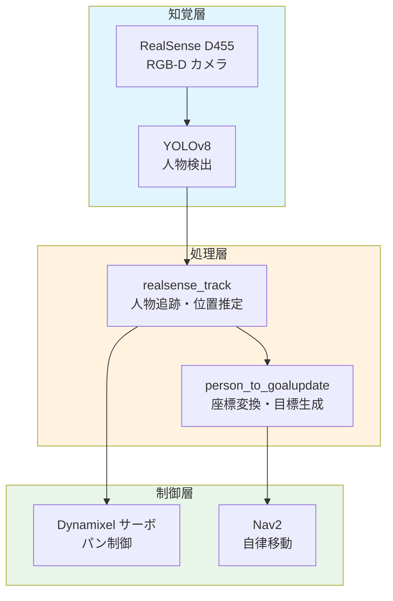

### データフロー概要

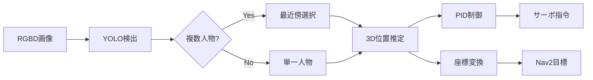

---

## realsense_track.py の詳細ロジック

### 1. 人物検出と追跡

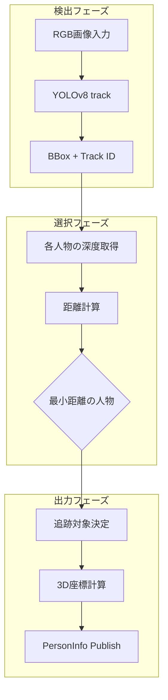

#### ロジック詳細

**YOLOv8のトラッキング機能を活用**

```python
results = self.model.track(self.rgb_image, persist=True, classes=[0])
```

- `persist=True`: フレーム間でIDを維持（同一人物追跡）
- `classes=[0]`: 人物クラスのみ検出

**最近傍人物選択アルゴリズム**

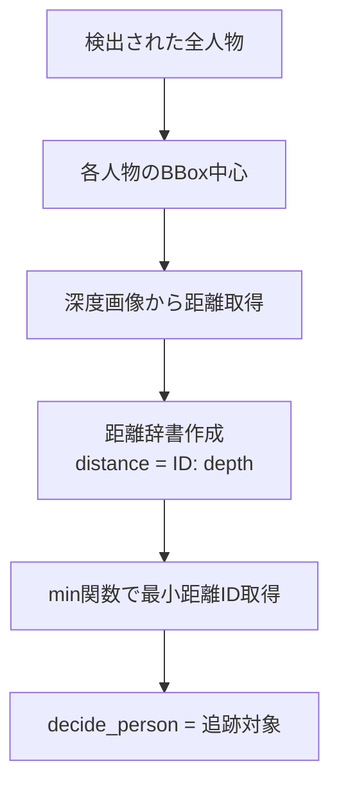

### 2. 3D位置推定

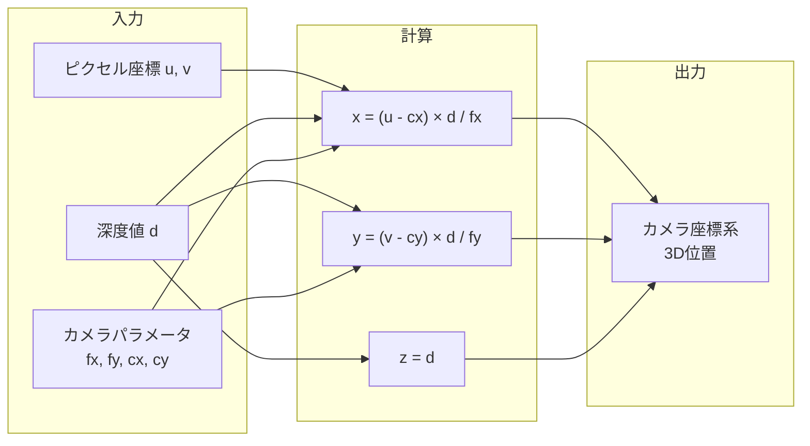

#### 深度値取得の工夫

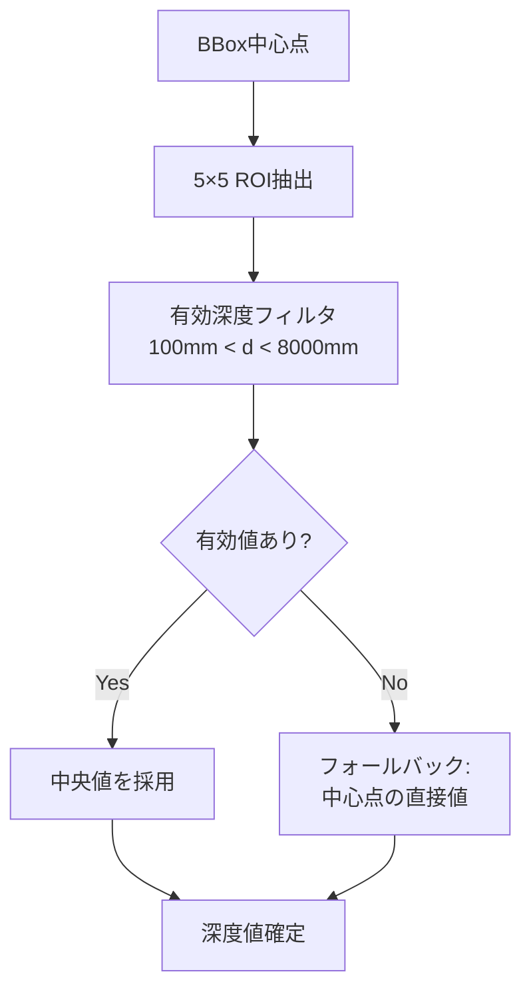

**ノイズ耐性の向上**
- 単一ピクセルではなく5×5領域の中央値を使用
- 異常値（100mm未満、8000mm超）を除外
- フォールバック処理で検出失敗を防止

### 3. PID制御によるサーボ追従

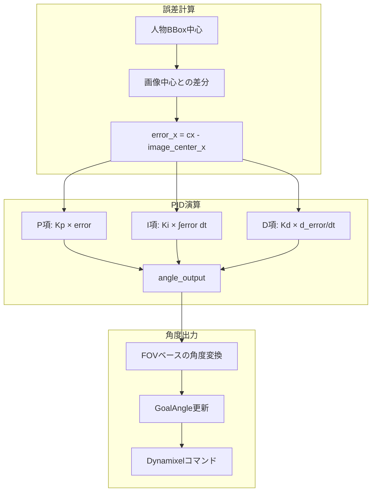

#### PIDパラメータ設計

| パラメータ | 値 | 役割 |
|-----------|-----|------|
| Kp | 5.0 | 追従速度の決定 |
| Ki | 0.3 | 定常偏差の除去 |
| Kd | 1.6 | オーバーシュート抑制 |

**角度変換の計算**

```python
horizontal_fov = 2 * math.atan(image_width / (2 * fx))
angle_per_pixel = horizontal_fov / image_width
target_angle = angle_output * angle_per_pixel
```

### 4. 座標変換（カメラ→ロボット）

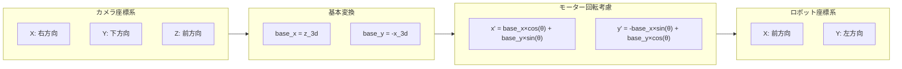

---

## person_to_goalupdate.py の詳細ロジック

### 1. TF2による座標変換

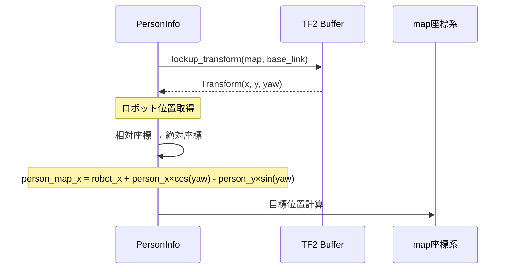

#### 座標変換の数学的表現

**回転行列による変換**

$$
\begin{bmatrix} x_{map} \\ y_{map} \end{bmatrix} = 
\begin{bmatrix} x_{robot} \\ y_{robot} \end{bmatrix} +
\begin{bmatrix} \cos\theta & -\sin\theta \\ \sin\theta & \cos\theta \end{bmatrix}
\begin{bmatrix} x_{rel} \\ y_{rel} \end{bmatrix}
$$

### 2. ナビゲーション目標管理

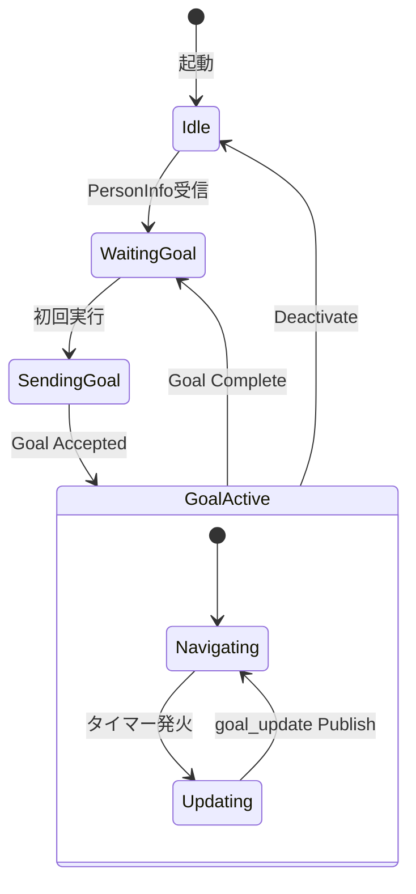

#### タイマーベースの目標更新

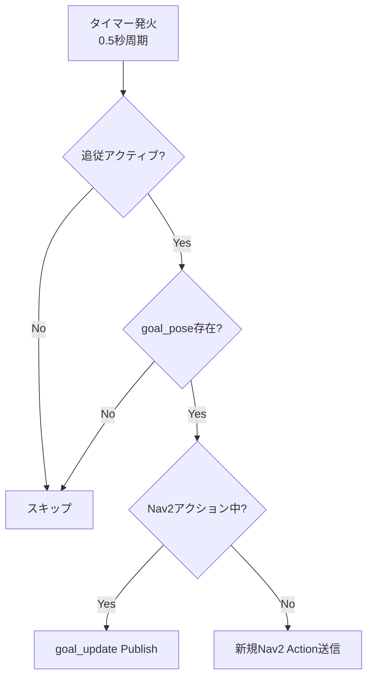

---

## 実装上の工夫

### 1. ロバスト性向上

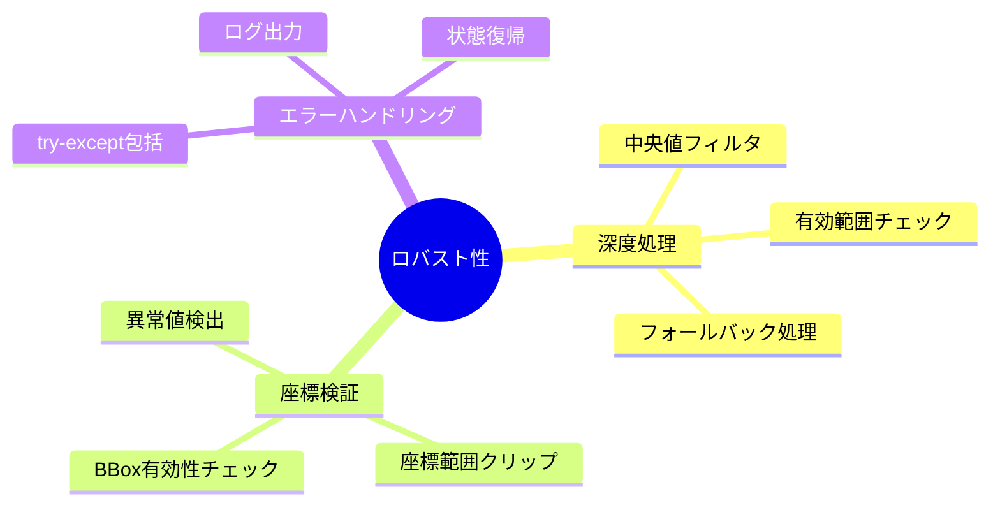

#### 深度ノイズ対策

| 問題 | 対策 | 効果 |
|------|------|------|
| 単一ピクセルノイズ | 5×5 ROI + 中央値 | 外れ値の影響を軽減 |
| 無効深度値 | 100-8000mm範囲フィルタ | 測定限界外を除外 |
| 深度取得失敗 | フォールバック処理 | 追跡継続を保証 |

### 2. 処理効率化

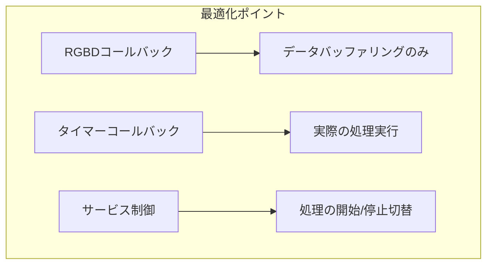

**分離設計の利点**
- RGBDコールバック: 軽量化（バッファリングのみ）
- タイマー: 20Hz固定レートで処理
- 処理落ち時もデータ欠損なし

### 3. 座標系の一貫性

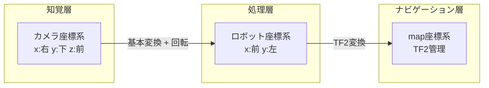

#### 座標変換の段階的処理

1. **カメラ→ロボット基本変換**: 軸の入れ替え
2. **モーター回転補正**: パン角度を考慮
3. **ロボット→map変換**: TF2による絶対座標化

### 4. 動的目標追従

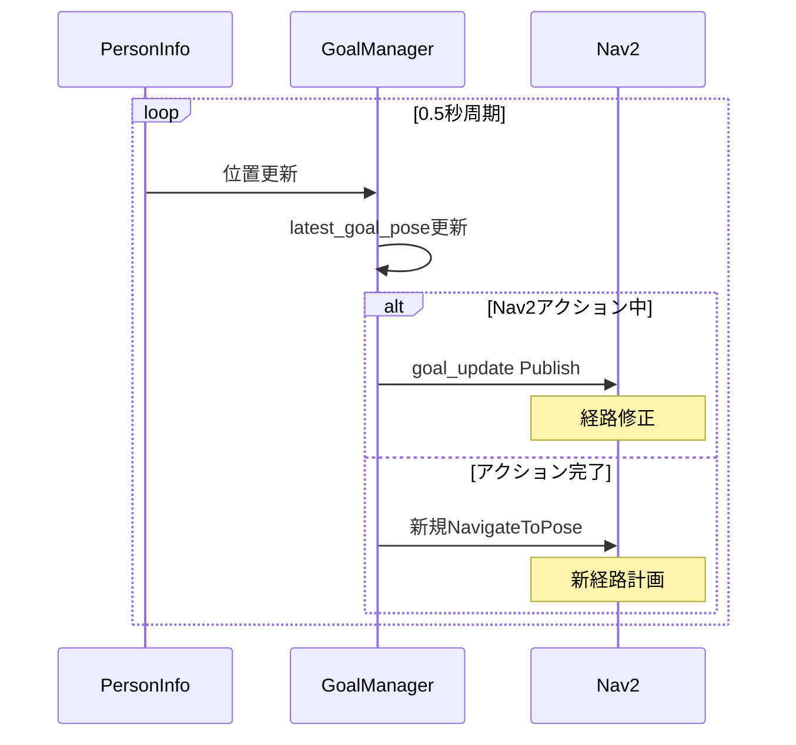

**工夫ポイント**
- `goal_update` トピック: アクション中でも目標更新可能
- カスタムBehavior Tree: 動的目標に対応した経路計画
- タイマーベース更新: 安定した更新レート保証

### 5. サービスによる状態制御

```mermaid
flowchart TD
    subgraph Services["サービスインターフェース"]
        A[/start_person_tracking]
        B[/stop_person_tracking]
        C[/person_follow_active]
        D[/person_follow_deactive]
    end

    subgraph States["内部状態"]
        E[is_running]
        F[person_follow_active]
        G[current_goal_handle]
    end

    A --> E
    B --> E
    C --> F
    D --> F
    D --> G
```

**安全な停止処理**
```python
def person_follow_deactivater_callback(self, request, response):
    self.person_follow_active = False
    
    # アクティブなゴールをキャンセル
    if self.current_goal_handle is not None:
        cancel_future = self.current_goal_handle.cancel_goal_async()
        cancel_future.add_done_callback(self.cancel_done_callback)
```

---

## まとめ

### 設計思想

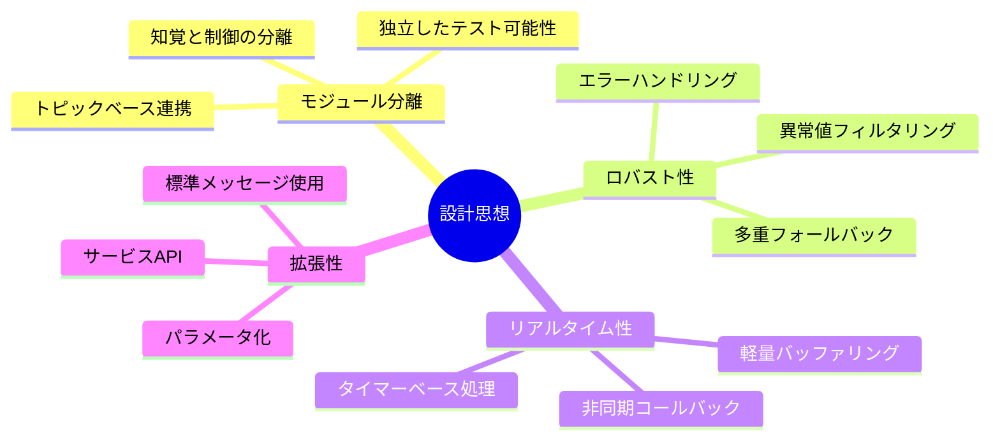

### 今後の改善候補

1. **カルマンフィルタ導入**: 位置推定の平滑化
2. **複数人物追跡**: ID維持・切替ロジック
3. **障害物回避強化**: コストマップとの統合
4. **学習ベース最適化**: PIDゲインの自動調整

---

## 付録: ピンホールカメラモデルによる座標変換

本システムでは、2D画像座標から3D空間座標への変換にピンホールカメラモデルを使用しています。

### ピンホールカメラモデルとは

ピンホールカメラモデルは、3次元空間の点を2次元画像平面に投影する数学的モデルです。

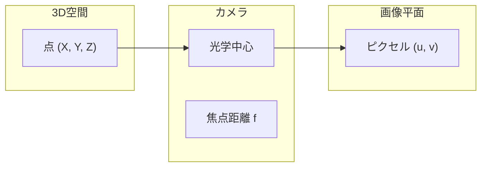

### 座標変換の数式

#### カメラ内部パラメータ（Intrinsic Matrix）

カメラの内部パラメータは以下の行列 $\mathbf{K}$ で表されます：

$$
\mathbf{K} = \begin{pmatrix}
f_x & 0 & c_x \\
0 & f_y & c_y \\
0 & 0 & 1
\end{pmatrix}
$$

**パラメータの説明**

| パラメータ | 記号 | 説明 | 単位 |
|-----------|------|------|------|
| 焦点距離（X方向） | $f_x$ | X軸方向のピクセル単位焦点距離 | pixel |
| 焦点距離（Y方向） | $f_y$ | Y軸方向のピクセル単位焦点距離 | pixel |
| 光学中心（X） | $c_x$ | 画像主点のX座標 | pixel |
| 光学中心（Y） | $c_y$ | 画像主点のY座標 | pixel |
| 深度 | $Z$ | カメラからの距離 | meter |

#### 順方向変換（3D → 2D 投影）

3次元空間の点 $\mathbf{P} = (X, Y, Z)^T$ を画像平面上の点 $\mathbf{p} = (u, v)^T$ に投影します。

**同次座標系での表現：**

$$
\begin{pmatrix}
u' \\
v' \\
w
\end{pmatrix}
= \mathbf{K} \cdot
\begin{pmatrix}
X \\
Y \\
Z
\end{pmatrix}
=
\begin{pmatrix}
f_x & 0 & c_x \\
0 & f_y & c_y \\
0 & 0 & 1
\end{pmatrix}
\begin{pmatrix}
X \\
Y \\
Z
\end{pmatrix}
$$

**正規化：**

$$
u = \frac{u'}{w} = f_x \cdot \frac{X}{Z} + c_x
$$

$$
v = \frac{v'}{w} = f_y \cdot \frac{Y}{Z} + c_y
$$

#### 逆変換（2D → 3D 復元）- 本システムで使用

深度 $Z$ が既知の場合、画像座標 $(u, v)$ から3D座標 $(X, Y, Z)$ を復元できます：

$$
\boxed{
X = \frac{(u - c_x) \cdot Z}{f_x}
}
$$

$$
\boxed{
Y = \frac{(v - c_y) \cdot Z}{f_y}
}
$$

**行列形式での逆変換：**

$$
\begin{pmatrix}
X \\
Y \\
Z
\end{pmatrix}
= Z \cdot \mathbf{K}^{-1}
\begin{pmatrix}
u \\
v \\
1
\end{pmatrix}
= Z \cdot
\begin{pmatrix}
\frac{1}{f_x} & 0 & -\frac{c_x}{f_x} \\
0 & \frac{1}{f_y} & -\frac{c_y}{f_y} \\
0 & 0 & 1
\end{pmatrix}
\begin{pmatrix}
u \\
v \\
1
\end{pmatrix}
$$

### 変換プロセスの詳細

```mermaid
flowchart TD
    subgraph Input["入力データ"]
        A[YOLO検出<br/>BBox中心座標<br/>"(u, v)"]
        B[深度画像<br/>Depth値<br/>"Z"]
        C[カメラ内部パラメータ<br/>"K"]
    end
    
    subgraph Transform["ピンホール逆変換"]
        D["X = (u - c_x) · Z / f_x"]
        E["Y = (v - c_y) · Z / f_y"]
    end
    
    subgraph Output["出力"]
        F["3D座標<br/>(X, Y, Z)"]
    end
    
    A --> D
    A --> E
    B --> D
    B --> E
    C --> D
    C --> E
    D --> F
    E --> F
```

### 実装コード

`realsense_track.py` での実装：

```python
def calculate_3d_position(self, center_x, center_y, depth):
    """
    2D画像座標と深度から3D空間座標を計算
    
    数式:
        X = (u - c_x) * Z / f_x
        Y = (v - c_y) * Z / f_y
    
    Args:
        center_x (u): BBox中心のX座標（ピクセル）
        center_y (v): BBox中心のY座標（ピクセル）
        depth (Z): 深度値（メートル）
    
    Returns:
        (X, Y, Z): カメラ座標系での3D位置
    """
    # カメラ内部パラメータの取得
    fx = self.camera_intrinsics.fx  # f_x: X方向焦点距離
    fy = self.camera_intrinsics.fy  # f_y: Y方向焦点距離
    cx = self.camera_intrinsics.ppx # c_x: 光学中心X
    cy = self.camera_intrinsics.ppy # c_y: 光学中心Y
    
    # ピンホールカメラモデルの逆変換
    x = (center_x - cx) * depth / fx  # X = (u - c_x) * Z / f_x
    y = (center_y - cy) * depth / fy  # Y = (v - c_y) * Z / f_y
    z = depth                          # Z = depth
    
    return x, y, z
```

### RealSense座標系

カメラ座標系 $\mathcal{C}$ は以下のように定義されます：

- $X_c$ 軸: 右方向（画像の横軸に対応）
- $Y_c$ 軸: 下方向（画像の縦軸に対応）
- $Z_c$ 軸: 前方（深度方向、カメラの光軸）

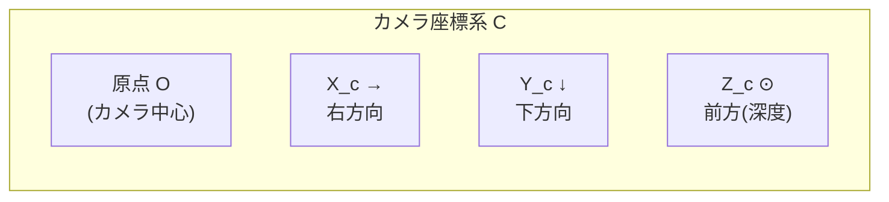

```
カメラ座標系の視覚化:

        Z_c (前方/深度)
         ↑
         │
         │
         ●───→ X_c (右方向)
        /
       /
      ↓
     Y_c (下方向)
```

### なぜこの変換が機能するのか

#### 数学的根拠

ピンホールカメラモデルにおいて、3D点 $\mathbf{P}$ と画像点 $\mathbf{p}$ の関係は：

$$
\lambda \begin{pmatrix} u \\ v \\ 1 \end{pmatrix} = \mathbf{K} \begin{pmatrix} X \\ Y \\ Z \end{pmatrix}
$$

ここで $\lambda = Z$ はスケールファクターです。

RGB-Dカメラでは $Z$（深度）が直接測定できるため、逆変換が一意に決定されます：

$$
\begin{pmatrix} X \\ Y \\ Z \end{pmatrix} = Z \cdot \mathbf{K}^{-1} \begin{pmatrix} u \\ v \\ 1 \end{pmatrix}
$$

```mermaid
flowchart TB
    subgraph Key["成功の鍵"]
        A["RGB-Dカメラ<br/>深度 Z を直接測定"]
        B["キャリブレーション<br/>K が既知"]
        C["数学的一意性<br/>Z + (u,v) → (X,Y,Z)"]
    end
    
    A --> D["各ピクセルの<br/>深度値が利用可能"]
    B --> E["工場出荷時に<br/>較正済み"]
    C --> F["逆変換が<br/>一意に決定"]
    
    D --> G["正確な3D位置推定"]
    E --> G
    F --> G
```

### RealSense SDK との比較

本システムの手動実装と同等の機能が `pyrealsense2` に用意されています：

```python
# pyrealsense2 の関数を使用する場合
import pyrealsense2 as rs

point_3d = rs.rs2_deproject_pixel_to_point(
    intrinsics,              # カメラ内部パラメータ
    [center_x, center_y],    # 2D画像座標
    depth                    # 深度値
)
# point_3d = [X, Y, Z]
```

**手動実装のメリット**
- 処理の透明性（デバッグしやすい）
- カスタマイズ可能（フィルタリング等を追加しやすい）
- 依存関係の軽減

### 座標変換チェーン全体

本システムでの座標変換の全体像：

```mermaid
flowchart LR
    subgraph S1["Step 1: 2D検出"]
        A["YOLO BBox<br/>(u, v)"]
    end
    
    subgraph S2["Step 2: 深度取得"]
        B["Depth Map<br/>Z"]
    end
    
    subgraph S3["Step 3: ピンホール逆変換"]
        C["カメラ座標<br/>(X_c, Y_c, Z_c)"]
    end
    
    subgraph S4["Step 4: ロボット座標変換"]
        D["ロボット座標<br/>(X_r, Y_r)"]
    end
    
    subgraph S5["Step 5: TF2変換"]
        E["マップ座標<br/>(X_m, Y_m)"]
    end
    
    A --> C
    B --> C
    C --> D
    D --> E
```

#### カメラ→ロボット座標変換（Step 4）

カメラ座標系 $\mathcal{C}$ からロボット座標系 $\mathcal{R}$ への変換を行います。

**座標系の定義：**
- カメラ座標系 $\mathcal{C}$: $X_c$（右）, $Y_c$（下）, $Z_c$（前）
- ロボット座標系 $\mathcal{R}$: $X_r$（前）, $Y_r$（左）

**モーター回転を考慮した変換：**

パンモーターの現在角度を $\theta$ [rad] とすると：

$$
\boxed{
\begin{aligned}
X_r &= Z_c \cos\theta - X_c \sin\theta \\
Y_r &= -(Z_c \sin\theta + X_c \cos\theta)
\end{aligned}
}
$$

**回転行列による表現：**

$$
\begin{pmatrix}
X_r \\
Y_r
\end{pmatrix}
=
\begin{pmatrix}
\cos\theta & -\sin\theta \\
-\sin\theta & -\cos\theta
\end{pmatrix}
\begin{pmatrix}
Z_c \\
X_c
\end{pmatrix}
$$

```python
# カメラ座標系: X_c(右), Y_c(下), Z_c(前)
# ロボット座標系: X_r(前), Y_r(左)

import math

# モーター回転を考慮した変換
theta = motor_angle_rad  # パンモーターの角度 [rad]

x_robot = z_camera * math.cos(theta) - x_camera * math.sin(theta)
y_robot = -(z_camera * math.sin(theta) + x_camera * math.cos(theta))
```

#### TF2によるマップ座標変換（Step 5）

ロボット座標系 $\mathcal{R}$ からマップ座標系 $\mathcal{M}$ への変換は、TF2を用いて行います：

$$
\mathbf{P}_{\mathcal{M}} = \mathbf{T}_{\mathcal{R}}^{\mathcal{M}} \cdot \mathbf{P}_{\mathcal{R}}
$$

ここで $\mathbf{T}_{\mathcal{R}}^{\mathcal{M}}$ は `base_link` から `map` への変換行列です。
